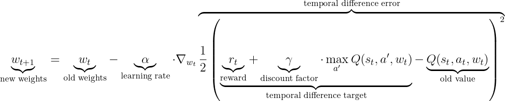

# Lab 6 Q-learning w świecie Pacmana

## Acknowledgement
Zadanie to bazuje (włącznie z kodem) na jednym z zadań z kursu [CS188 na UC Berkley](http://ai.berkeley.edu/home.html), dostępnym także na [edX](https://edge.edx.org/courses/BerkeleyX/CS188x-8/Artificial_Intelligence/about) jeśli ktoś nie planuje zmieniać uczelni w najbliższym czasie. Gorąco zachęcam do wzięcia w nim udziału.

## Cel
Celem tego ćwiczenia jest poznanie jednego z najbardziej popularnych i eleganckich algorytmów uczenia ze wzmocnieniem: Q-learningu. 

## Zadanie
Zadaniem jest zaimplementowanie algorytmu Q-learninig, który nauczy się grać w Pacmana. Rozwiązanie przetestowane zostanie 100-krotnie na wielu instancjach z losowymi lub złośliwymi duchami - część plansz jest dostępna  w folderze [pacman_layouts](pacman_layouts) (można się na nich uczyć, można też stworzyć własne). 

Rozwiązania powinny być już nauczonymi agentami, lecz zgłoszenie powinno zawierać też **kod** i **dane/** użyte do treningu oraz **instrukcję** odtworzenia uczenia w sposób deterministyczny. **W przypadku braku kodu uczącego, zadanie nie zostanie zaliczone.**

> Niestety nie ma żadnej automatycznej metody weryfikacji faktycznego zaimplementowania Q-learning poza weryfikacją kodu. W przypadku wykrycia braku implementacji Q-learningu (a coś innego, np systemy regułowe, przeszukiwanie drzewa itd.) rozwiązanie nie zostanie zakceptowane (0 punktów).

## Od czego zacząć
Sklonować to repozytorium, zainstalować pakiet misio, następnie odpalić skrypt [pacman_run.py](pacman_run.py). Odpali on pojedynczą grę (obsługa przez klawiaturę).

Skrypt ma wiele opcji, aby je zobaczyć nalezy użyć przełącznika **--help**/**-h**. Można tu odpalać własnych agentów, grać samemu, testować, trenować. Zachęcam do przeskanowania jego treści i dowolnych modyfikacji (będą konieczne do uczenia).

## Pierwsze zgłoszenie

Wyżej wspomniany skrypt pokazuje jak odpalać agentów lokalnie. By zgłosić agenta na [Optil.io](https://www.optil.io/optilion/problem/3179) należy użyć **StdIOPacmanRunner**, który załatwi wszelką komunikację przez stdin i stdout dla agenta już kompatybilnego z lokalnym interfacem. Zastosowanie wrappera zaprezentowane jest  w skrypcie [greedy_solution.py](greedy_solution.py) wykorzystującym agenta zachłannego, który jest jednak z zabawy wykluczony (nie implementuje Q-learningu).

## Kod uczący
Żeby zadanie zostało zaliczone należy wysłać także kod uczący i instrukcję. W takim wypadku przyda się wrzucenie większej liczby plików w archiwum. Przykład zaprezentowany jest w [sample_solution](sample_solution) ( w szczególności [create_bundle.sh](sample_solution/create_bundle.sh)).


## Q-learning
Na starcie można obejrzeć filmik z kursu, z którego wzięte zostało to zadanie na [YouTube](https://www.youtube.com/watch?v=w33Lplx49_A).

Q-learning to algorytm do rozwiązywania MDP. Zamiast spotkanej wcześniej wartości stanu V(S) używa on Q(S,A), które mówi jaki jest oczekiwany zysk od teraz w przyszłość jeśli będziemy postępować według danej polityki. W najprostszej formulacji można użyć tabelki z zapisywanymi wartościami i aktualizować je tak jak w algorytmie value iteration (poprzednie zadanie). Niestety często dzieje się tak, że przestrzeń stanów jest zbyt duża by zastosować dokładne rozwiązanie - w tym momencie do uzyskania Q używamy funkcji aproksymującej zależnej od stanu i akcji. Funkcja taka może być dowolna, najczęściej stosuje się sieci neuronowe. Mając taką funkcję możemy policzyć (dla dowolnego przejścia (S,A,S',R)) błąd predykcji naszego aproksymatora oraz gradient względem parametrów aproksymatora. Mając gradient możemy poprawić naszą aproksymację - zasadniczo jest to uczenie nadzorowane na niestacjonarnej funkcji straty. Dokłądny wzór pokazany jest poniżej:


Zazwyczaj Q w "temporal difference target" wyłączone jest z propagacji gradientu (traktuje się je jako niezależną stałą).

Tak wyglądałaby aktualizacja gdyby Q(s,a) było stablicowane (z Wikipedii): 


Psudokod najprostszego q-learningu:

```c++
# w <- parametry naszej funkcji aproksymującej

while True:
    zaobserwuj stan s
    wykonaj arbitralnie wybraną akcję a
    otrzymaj nagrodę r
    zaobserwuj stan s'
    oblicz błąd TDerror = 0.5*(Q(s,a) - (r + gamma*max(Q(s',a')))^2
    oblicz gradient g z TDerror po w
    zaktualizuje wagi w: w -= alfa*g

```

Aby dokonać wyboru akcji, wystarczy wybrać akcję z największym Q, nie jest nam potrzebne R, ani P tak jak w Value Iteration. P i R nazywa się kolektywnie modelem - Q-learning ich nie potrzebuje, dlatego jest nazywany algorytmem **model-free**. Ważną cechą tego algorytmu jest też niezależność treningu od wykonywanych akcji ("off-policy"). Konkretnie, jeśli każdą akcję wykonamy w każdym stanie nieskończoną ilość razy to Q zbiegnie do dobrej wartości. Jest to oczywiście dość idylliczna właściwość gdyż nie mamy nieskończonego budżetu, lecz w ogólności pozwala na dużą swobodę jeśli chodzi o eksplorację. Z tego powodu najpopularniejszą strategią eksploracji jest **epsilon-greedy**, która z prawdopodobieńśtwem **epsilon** wykonuje akcję losową, a w przeciwnym  wypadku najlepszą akcję według aktualnej polityki (czyli argmax (Q)). Typowo zaczyna się od dużych wartości (np. 1), a kończy się na wartościach małych (np. 0).


Najprostszym rozwiązaniem problemu jest zrobienie ekstrakcji cech F(Q,S) i użycie funkcji liniowej jako aproksymatora. I to jest właśnie zadanie: zaimplementować q-learning używający np. aproksymatora liniowego.

## Co warto przejrzeć
* [qlearningAgents.py](qlearningAgents.py) - szkielet algorytmu, nie trzeba go używać, ale może nakierować na dobrą drogę (chociaż dużo rzeczy tu dziwnie zaimplementowano więc część łatwiej napisać od 0 używając operacji macierzowych z numpy),
* [featureExtractors.py](../misio/pacman/featureExtractors.py) - przykładowe proste ekstraktory cech dla par (a,s). Najbardziej popularne implementacje Q-learningu używają raczej f(s) i utrzymują osobne Q(s) dla każdej akcji (a właściwie osobne wyjścia w sieci neuronowej), lecz jest to kwestia implementacyjno wydajnościowa,
* [pacman.py](../misio/pacman/pacman.py) oraz [game.py](../misio/pacman/game.py) - klasy odpowiedzialne za grę i stan (głównie w celu dowiedzenia się jakie cechy możemy wyciągnąć).

## Co dalej?
Do zaliczenia zadania wystarczający jest liniowy aproksymator i odpowiednie cechy, lecz zachęcam do zaimplementowania czegoś bardziej skomplikowanego np. 
* zmniejszanie epsilona z czasem,
* zmiany techniki optymalizacji, np. użycie zmiennej prędkości uczenia, lub użycie optymalizatora takiego jak Adagrad zamiast zwykłej aktualizacji GD,
* użycia sieci neuronowych (liczenie gradientów robi się wtedy nieprzyjemne dlatego warto zastosować gotowe biblioteki do ML, np. PyTorch lub Tensorflow),
* zaimplementowania 'replay memory' ([DQN](https://www.cs.toronto.edu/~vmnih/docs/dqn.pdf)),
* zaimplementowania network freezing ([DQN](https://www.cs.toronto.edu/~vmnih/docs/dqn.pdf)).
 

## Zaliczenie
* Zgłoszenie rozwiązania na platformie [Optil.io](https://www.optil.io/optilion/problem/3179),
* Wzięte zostanie pod uwagę **OSTATNIE** zgłoszenie,
* Termin: **przed** rozpoczęciem lipca 2020

## Punktacja
* **15** punktów według wzoru P(score) = TODO, gdzie score jest to sumaryczna ilość punktów ze wszystkich instancji. Ze wzoru tego uzyskać można do 20 punktów (do 5 punktów dodatkowych).
* By zaliczyć zadanie należy otrzymać **POWYŻEJCONAJMNIEJ** 30% punktów (4.5)
* **Spóźnienie**: spóźnienia nie są dopuszczalne, należy dostarczyć rozwiązanie przed rozpoczęciem lipca 2020.
